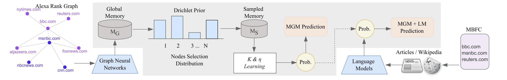

# MGM: Global Understanding of Audience Overlap Graphs for Predicting the Factuality and the Bias of News Media


> **<p align="justify"> Abstract:** *In the current era of rapidly growing digital data, evaluating the political bias and factuality of news outlets has become more important for seeking reliable information online. In this work, we study the classification problem of profiling news media from the lens of political bias and factuality. Traditional profiling methods, such as Pre-trained Language Models (PLMs) and Graph Neural Networks (GNNs) have shown promising results, but they face notable challenges. PLMs focus solely on textual features, causing them to overlook the complex relationships between entities, while GNNs often struggle with media graphs containing disconnected components and insufficient labels. To address these limitations, we propose MediaGraphMind (MGM), an effective solution within a variational Expectation-Maximization (EM) framework. Instead of relying on limited neighboring nodes, MGM leverages features, structural patterns, and label information from globally similar nodes. Such a framework not only enables GNNs to capture long-range dependencies for learning expressive node representations but also enhances PLMs by integrating structural information and therefore improving the performance of both models. The extensive experiments demonstrate the effectiveness of the proposed framework and achieve new state-of-the-art results. Further, we share our repository1 which contains the dataset, code, and documentation.* </p>

## Main Contributions

1) **Enhancing GNNs:** We introduce MGM to enhance GNNs for reliable news media profiling by leveraging global information and minimizing memory requirements via a sparse distribution.
2) **Effectiveness of MGM:** We illustrate that MGM consistently outperforms vanilla GNNs for the detection of factuality and political bias across all baselines.
3) **MGM with PLMS:** We validate that integrating the MGM features with the Pretrained Language Models enhances performance and yields state-of-the-art results.

## Task 

News media profiling involves analyzing and categorizing news sources to determine their political bias (e.g., left, center, right) and factual reliability (high, mixed, low). By leveraging text-based features, media graphs, and machine learning models, this system helps automate media evaluation, providing insights into how different sources frame information.


## Installation
The codebase has been tested on Ubuntu 20.04.2 LTS using Python 3.8. To set up the environment and install the necessary dependencies, please follow the steps outlined below.


```shell
conda env create -f environment.yml
```

## Implementation Details

MGM can be equipped with various GNN models:

- GCN
- GraphSAGE
- GAT
- SGC
- DNA
- FILM
- FAGCN
- GATv2Conv


## Data 

Data files are available in the data directory with the name of fact and bias. dataset.py is used to load the bias data. dataset_fact.py is used to load the data for factuality task.

## MGM Training 

- To replicate our experimental results for the Factuality dataset, please use the following command to train the MGM based models:

```bash
python nmp_fact.py --cuda_id 0 --model [gcn/graphsage/gat/sgc/dna/gcnii/film/ssgc/fagcn/gatv2] --criterion sigmoid --hidden_dim [16,32,64..] --log_dir ./your_log --k 3 --eta [0.5,0.6,0.7,0.8,0.9,1] --val_test_batch_size 2 --epochs 50 --run_times 5 --normalize True --gnn_lr 0.001 --vae_lr 0.0001 --sim_function feature_base
```

- To replicate our experimental results for the Bias dataset, please use the following command to train the MGM based models:

```bash
python nmp_bias.py --cuda_id 0 --model [gcn/graphsage/gat/sgc/dna/gcnii/film/ssgc/fagcn/gatv2] --criterion sigmoid --hidden_dim [16,32,64..] --log_dir ./your_log --k 3 --eta [0.5,0.6,0.7,0.8,0.9,1] --val_test_batch_size 2 --epochs 50 --run_times 5 --normalize True --gnn_lr 0.001 --vae_lr 0.0001 --sim_function feature_base
```

## Descriptions for command arguments:
hidden_dim: The dimensionality of the hidden layer, matching the baseline's configuration as described in the main paper.

K: The number of globally similar nodes to consider.

eta: A hyperparameter controlling the balance between local and global information.

    eta = 1: Relies solely on local information, similar to the baseline models.
    eta = 0.5: Equally weighs local and global information using the MGM approach.

## Citation

If you use our work, please consider citing:
``` bibtex
@article{manzoor2024mgm,
  title={MGM: Global Understanding of Audience Overlap Graphs for Predicting the Factuality and the Bias of News Media},
  author={Manzoor, Muhammad Arslan and Zeng, Ruihong and Azizov, Dilshod and Nakov, Preslav and Liang, Shangsong},
  journal={arXiv preprint arXiv:2412.10467},
  year={2024}
}
```
